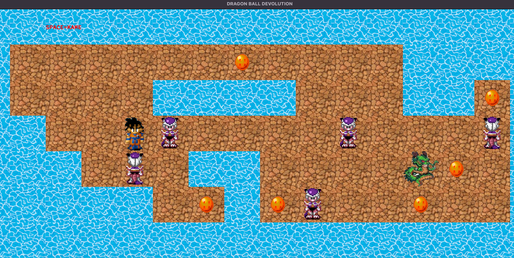

# so_long

## Explanation of the project

This projects goal is to create your own 2D game where you have a map that can have different dimensions and contents.<br>

### Requirements to run the game
Tested on **macOS** and **Linux**.<br>
For all other OS it is not guaranteed to work.<br>
OpenGL and AppKit is required to run it.<br>

### Map
A valid map is structured as followed:<br>
- 1 player (`P`)
- at least 1 exit (`E`)
- at least 1 collectible (`C`)`
- is recatangular
- has a solid outside border out of walls (`1`)
- all the empty spaces are filled with `0`
- map has to be `.ber`
- no other characters than:
  * `P`
  * `E`
  * `C`
  * `1`
  * `0`
- maps in /maps/ `final.ber` or 'map.ber' :
- one new line after the map is valid, if there is anything else, it is not valid

```
1111111111111
10010000000C1
1000011111001
1P0011E000011
1111111111111
```

<br>

### During the game
The player can only be moved by `WASD`.<br>
The player can not move into walls.<br>
The player can only exit if all collectibles are collected.<br>
The amount of movements is counted and displayed in the terminal.<br>
Every try to move even if it is invalid will be counted as one move.<br>

All the visualization is done with the help of the [MiniLibX library](https://github.com/tblaase/so_long/tree/master/mlx "https://github.com/tblaase/so_long/tree/master/mlx").<br>

## How to run the game

All of the commands should be run in the root of the directory.<br>
- compile with `make all`
- run the game with `./so_long maps/final.ber`

This is how the game looks.<br>
<br>
